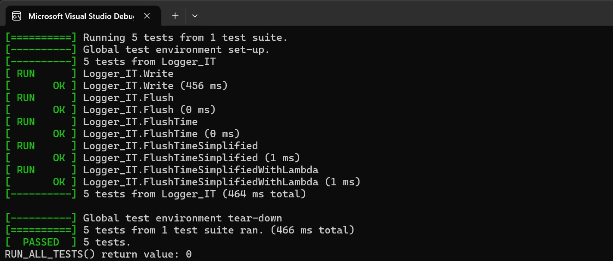

# Integration Test Framework using Google Test and Delegates
An integration test framework used for testing multi-threaded C++ based projects using Google Test and Asynchronous Multicast Delegate libraries. All target devices are supported including Windows, Linux, and embedded systems.

## Overview
Testing mission critical software is crucial. For medical devices, the IEC 62304 provides guidance on the required software development process. Three levels of software testing are defined:

1. **Unit Testing** - Verifies individual units of code in isolation.
2. **Integration Testing** - Tests multiple units of code integrated and working together.
3. **System Testing** - Evaluates system as a whole to ensure it meets specified requirements.

Unit testing is well understood, with numerous frameworks (including Google Test) readily available and easily incorporated into a CI/CD toolchain pipeline. System testing is also well-documented, with various techniques and tools available. However, in my experience, integration testing is more challenging to create.

This project implements an integration testing framework for multi-threaded C++ applications, compatible with any system supporting C++, including Windows and Linux. It has no external OS dependencies or libraries beyond the standard C++ library. Multi-threading is achieved using the C++ thread support library, eliminating the need for OS-specific dependencies. Alternatively, write a small amount of code to port the framework to any PC or embedded operating system.

## References
* [Goolge Test](https://github.com/google/googletest) - Google Test is a C++ unit testing framework that provides an API for writing and running unit tests.

* [Asynchronous Multicast Delegates (C++17)](https://github.com/endurodave/AsyncMulticastDelegateModern) - A C++ standards compliant delegate library capable of targeting any callable function synchronously or asynchronously.

* [C++ std::thread Event Loop](https://github.com/endurodave/StdWorkerThread) - A worker thread using the C++ thread support library.

### Alternative Delegate Libraries
This example utilizes the C++17 and higher delegate library. Alternate delegate libraries exist for lower-spec toolchains. All delegate libraries operate on Windows, Linux and other platforms.

* [Asynchronous Multicast Delegates (C++11)](https://github.com/endurodave/AsyncMulticastDelegateCpp11) - A C++11 and higher compliant delegate library capable of targeting any callable function synchronously or asynchronously.

* [Asynchronous Multicast Delegates (C++03)](https://github.com/endurodave/AsyncMulticastDelegate) - A C++03 and higher compliant delegate library capable of targeting any callable function synchronously or asynchronously.

## Logger Subsystem
The `Logger` class is the subsystem public interface. `Logger` executes in its own thread of control. The `Write()` API is thread-safe. 

* `void Write(const std::string& msg)`

`Logger` has an internal instance of `LogData` that performs the underlying logging. `LogData` is not thread safe and must only execute within the `Logger` thread context.

* `void Write(const std::string& msg);`
* `bool Flush();`

The `Logger` was designed without reliance on the features of the Delegate library. Therefore, the `Logger` and `LogData` modules include the `IT_ENABLE` conditional compile flag. These locations indicate the touch points added to the production code to facilitate integration testing.

```cpp
class Logger 
#ifdef IT_ENABLE
	: public DelegateLib::DelegateThread
#endif
{
public:

// etc...
```

The goal of the project is to provide an integration test framework with a simple example of testing the `Logger` subsystem in a multi-threaded environment.

## Source Code
The project contains the following directories:

* **Delegate** - the Delegate library source code directory
* **GoogleTest** - the Google Test library source code directory
* **IntegrationTest** - the integration test framework source code
* **Logger/it** - the Logger subsystem integration test source code
* **Logger/src** - the Logger subsystem production source code
* **Port** - supporting utilities source code files

## CMake Build
[CMake](https://cmake.org/) is used to create the project build files. See `CMakeLists.txt` for more information.

### Windows Visual Studio

`cmake -G "Visual Studio 17 2022" -A Win32 -B ../IntegrationTestFrameworkBuild -S . -DENABLE_IT=ON`

### Linux Make 

`cmake -G "Unix Makefiles" -B ../IntegrationTestFrameworkBuild -S . -DENABLE_IT=ON`

## Testing Strategy  
Software systems are complex, with numerous library and file dependencies, making integration testing challenging. It can be difficult to isolate and test a subsystem that consists of dozens or even hundreds of source files. This complexity is further compounded when the source code is intended to run only on an embedded target. While unit tests can isolate individual modules, integration testing increases complexity exponentially.

In my experience with medical device design, integration testing was typically performed by a software developer using a custom, one-off test setup that was manually executed and documented. These tests were not automated and were rarely, if ever, repeated. By applying the ideas and techniques outlined here, integration tests can be written and executed similarly to unit tests, providing a more robust and repeatable testing infrastructure.

While unit tests are typically executed off-target, the integration test framework presented here runs on-target, in parallel with normal device operation. The target device may be Windows, Linux or an embedded system. The tests can be executed in a special maintenance mode, when the system is idle, or alongside normal operations. Regardless of the mode, the tests run directly on the device, with results captured accordingly. In some cases, the test results are sent to an external logging machine via Ethernet or serial ports. In this project, the results are output to the screen.

As more integration tests are created, the product's executable image size increases. To manage this, the tests are distributed across multiple images, each with a specific purpose. For example, one image might test a logging subsystem, while another tests the alarm subsystem. Distributing the integration tests across multiple builds helps keep the image size manageable on memory constrained devices.

## Delegates
The Delegate library offers both synchronous and asynchronous function invocation, typically utilized in two design patterns:

* **Publish/Subscribe** - publisher exposes a delegate container to allow subscriber callbacks via anonymous runtime registration.
* **Asynchronous Call** - asynchronously invoke any function on a specified thread using either a blocking or non-blocking call.

See [Asynchronous Multicast Delegates (C++17)](https://github.com/endurodave/AsyncMulticastDelegateModern) for more information.

## Integration Tests
The integration tests are contained within `Logger_IT.cc`. All tests follow a similar pattern:

1. **Setup** - perform setup actions such as register for a callback or clear result data.
2. **Test** - invoke the function(s) under test to initiate testing.
3. **Wait** - wait for the subsystem to respond with test results, either synchronously or asynchronously during a callback.
4. **Check** - check the test results for success or failure.
5. **Cleanup** - cleanup the test such as unregister from callbacks.

### Write Test
The `Write` test is shown below. Notice the `Write` function is called, then the test waits for 500mS and 2000mS for callbacks before checking test results. If the `WaitForSignal()` returns `false`, the `LoggerSystemCb()` failed to arrive within the allotted time.

```cpp
// Logger callback handler function invoked from Logger thread context
void LoggerStatusCb(const string& status)
{
	// Save logger callback status
	callbackStatus.push_back(status);

	// Signal the waiting thread to continue
	signalThread.SetSignal();
}

// Test the Logger::Write() subsystem public API. 
TEST(Logger_IT, Write) 
{
	// Register to receive a Logger status callback
	Logger::GetInstance().SetCallback(&LoggerStatusCb);

	// Write a Logger string value using public API
	Logger::GetInstance().Write("LoggerTest, Write");

	// Wait for LoggerStatusCb callback up to 500mS
	bool success = signalThread.WaitForSignal(500);

	// Wait for 2nd LoggerStatusCb callback up to 2 seconds
	bool success2 = signalThread.WaitForSignal(2000);

	// Check test results
	EXPECT_TRUE(success);
	EXPECT_TRUE(success2);
	EXPECT_EQ(callbackStatus.size(), 2);
	if (callbackStatus.size() >= 2)
	{
		EXPECT_EQ(callbackStatus[0], "Write success!");
		EXPECT_EQ(callbackStatus[1], "Flush success!");
	}

	// Test cleanup
	Logger::GetInstance().SetCallback(nullptr);
}
```

Note that all `Logger_IT` tests execute within the `IntegrationTest` thread, while the callback occurs on the `Logger` thread. Locks protect the `callbackStatus` test results to ensure thread safety. The `Logger::Write()` API is thread-safe and therefore can be called directly from within the test code.

Additionally, observe how easily the integration test is constructed. It resembles a standard unit test, but utilizes two threads, with the Delegate library providing support for cross-thread function invocation.

### Flush Test
The `Flush` integration test is an example of targeting a non-thread safe subsystem internal module using the Delegate library. `MakeDelegate` creates an asynchronous blocking delegate targeted at `LogData::Flush()`. The `Logger` task invokes the function and the return value is stored in `retVal`. If `retVal.has_value()` is `true` the asynchronous function call succeed within 100mS. If `false`, the call failed to invoke within the allotted time frame. The `retVal.value()` contains the `LogData::Flush()` return value. The Delegate library makes invoking any function on a different thread very easy.

```cpp
// Test LogData::Flush() subsystem internal class. The internal LogData class is 
// not normally called directly by client code because it is not thread-safe. 
// However, the Delegate library easily calls functions on the Logger thread context.
TEST(Logger_IT, Flush)
{
	// Create an asynchronous blocking delegate targeted at the LogData::Flush function
	auto flushAsyncBlockingDelegate = MakeDelegate(
		&Logger::GetInstance().m_logData,   // LogData object within Logger class
		&LogData::Flush,                    // LogData function to invoke
		Logger::GetInstance(),              // Thread to invoke Flush (Logger is-a DelegateThread)
		milliseconds(100));                 // Wait up to 100mS for Flush function to be called

	// Invoke LogData::Flush on the Logger thread and obtain the return value
	std::optional<bool> retVal = flushAsyncBlockingDelegate.AsyncInvoke();

	// Check test results
	EXPECT_TRUE(retVal.has_value()); // Did async LogData::Flush function call succeed?
	if (retVal.has_value())
		EXPECT_TRUE(retVal.value()); // Did LogData::Flush return true?
}
```

### FlushTime Test
The `FlushTime` tests how long the system takes to execute `Flush()` enforcing a runtime timing constraint.

The production code within `LogData` was modified to add the `FlushTimeDelegate` member. All production code modifications to support integration testing are wrapped in the conditional compile flag `IT_ENABLE`.

```cpp
class LogData
{
public:
#ifdef IT_ENABLE
	DelegateLib::MulticastDelegateSafe<void(std::chrono::milliseconds)> FlushTimeDelegate;
#endif

// etc...
```

At runtime, the `FlushTimeDelegate(elapsedTime)` is invoked to callback the registered test.

```cpp
bool LogData::Flush()
{
#ifdef IT_ENABLE
    auto startTime = std::chrono::high_resolution_clock::now();
#endif

    // Write log data to disk
    std::ofstream logFile("LogData.txt", std::ios::app);
    if (logFile.is_open()) 
    {
        for (const std::string& str : m_msgData) 
        {
            logFile << str << std::endl;
        }
        logFile.close();

#ifdef IT_ENABLE
        auto endTime = std::chrono::high_resolution_clock::now();
        auto elapsedTime = std::chrono::duration_cast<std::chrono::milliseconds>(endTime - startTime);

        // Callback integration test with elapsed time
        FlushTimeDelegate(elapsedTime);
#endif
        return true;
    }
    return false;
}
```

The `FlushTimeCb()` is called and the test results stored within `flushDuration` for later test checks. The `FlushTimeCb()` is called by the `Logger` thread, therefore notice locks to protect `flushDuration` from cross thread access.

```cpp
// Logger callback handler function invoked from Logger thread context
void FlushTimeCb(milliseconds duration)
{
	// Protect flushTime against multiple thread access by IntegrationTest 
	// thread and Logger thread
	lock_guard<mutex> lock(mtx);

	// Save the flush time
	flushDuration = duration;
}

// Test LogData::Flush executes in under 10mS
TEST(Logger_IT, FlushTime)
{
	{
		// Protect access to flushDuration
		lock_guard<mutex> lock(mtx);
		flushDuration = milliseconds(-1);
	}

	// Register for a callback from Logger thread
	Logger::GetInstance().m_logData.FlushTimeDelegate += MakeDelegate(&FlushTimeCb);

	// Clear the m_msgData list on Logger thread
	auto retVal1 = MakeDelegate(
		&Logger::GetInstance().m_logData.m_msgData, // Object instance
		&std::list<std::string>::clear,             // Object function
		Logger::GetInstance(),                      // Thread to invoke object function
		milliseconds(50)).AsyncInvoke();

	// Check asynchronous function call succeeded
	EXPECT_TRUE(retVal1.has_value());

	// Write 10 lines of log data
	for (int i = 0; i < 10; i++)
	{
		//  Call LogData::Write on Logger thread
		auto retVal = MakeDelegate(
			&Logger::GetInstance().m_logData,
			&LogData::Write,
			Logger::GetInstance(),
			milliseconds(50)).AsyncInvoke("Flush Timer String");

		// Check asynchronous function call succeeded
		EXPECT_TRUE(retVal.has_value());

		// Check that LogData::Write returned true
		if (retVal.has_value())
			EXPECT_TRUE(retVal.value());
	}

	// Call LogData::Flush on Logger thread
	auto retVal2 = MakeDelegate(
		&Logger::GetInstance().m_logData,
		&LogData::Flush,
		Logger::GetInstance(),
		milliseconds(100)).AsyncInvoke();

	// Check asynchronous function call succeeded
	EXPECT_TRUE(retVal2.has_value());
	if (retVal2.has_value())
		EXPECT_TRUE(retVal2.value());

	{
		// Protect access to flushDuration
		lock_guard<mutex> lock(mtx);

		// Check that flush executed in 10mS or less
		EXPECT_GE(flushDuration, std::chrono::milliseconds(0));
		EXPECT_LE(flushDuration, std::chrono::milliseconds(10));
	}

	// Unregister from callback
	Logger::GetInstance().m_logData.FlushTimeDelegate -= MakeDelegate(&FlushTimeCb);
}
```

### FlushTestSimplified Test
The `FlushTestSimplified` example is identical to the previous test but uses the simplified syntax provided by the `AsyncInvoke<>` helper class. This class automatically handles asynchronous call timeouts and reports test failures if necessary.

```cpp
// Exact same test as FlushTime above, but uses the AsyncInvoke helper function
// to simplify syntax and automatically check for async invoke errors.
TEST(Logger_IT, FlushTimeSimplified)
{
	{
		// Protect access to flushDuration
		lock_guard<mutex> lock(mtx);
		flushDuration = milliseconds(-1);
	}

	// Register for a callback from Logger thread
	Logger::GetInstance().m_logData.FlushTimeDelegate += MakeDelegate(&FlushTimeCb);

	// Clear the m_msgData list on Logger thread
	auto retVal1 = AsyncInvoke(
		&Logger::GetInstance().m_logData.m_msgData, // Object instance
		&std::list<std::string>::clear,             // Object function
		Logger::GetInstance(),                      // Thread to invoke object function
		milliseconds(50));                          // Wait up to 50mS for async invoke

	// Write 10 lines of log data
	for (int i = 0; i < 10; i++)
	{
		//  Call LogData::Write on Logger thread
		auto retVal = AsyncInvoke(
			&Logger::GetInstance().m_logData,
			&LogData::Write,
			Logger::GetInstance(),
			milliseconds(50), 
			"Flush Timer String");

		// Check that LogData::Write returned true
		if (retVal.has_value())
			EXPECT_TRUE(retVal.value());  
	}

	// Call LogData::Flush on Logger thread
	auto retVal2 = AsyncInvoke(
		&Logger::GetInstance().m_logData,
		&LogData::Flush,	
		Logger::GetInstance(),
		milliseconds(100));

	{
		// Protect access to flushDuration
		lock_guard<mutex> lock(mtx);

		// Check that flush executed in 10mS or less
		EXPECT_GE(flushDuration, std::chrono::milliseconds(0));
		EXPECT_LE(flushDuration, std::chrono::milliseconds(10));
	}

	// Unregister from callback
	Logger::GetInstance().m_logData.FlushTimeDelegate -= MakeDelegate(&FlushTimeCb);
}
```

### FlushTestSimplifiedWithLambda Test
The `FlushTestSimplifiedWithLambda` example is identical to the previous test but uses a local lambda callback function. Sometimes a callback is only needed within a single test, and using a lambda function helps keep all the test code centralized in one place.

```cpp
// Exact same test as FlushTimeSimplified above, but use a private lambda callback 
// function to centralize the callback inside the test case. 
TEST(Logger_IT, FlushTimeSimplifiedWithLambda)
{
	// Logger callback handler lambda function invoked from Logger thread context
	auto FlushTimeLambdaCb = +[](milliseconds duration) -> void
	{
		// Protect flushTime against multiple thread access by IntegrationTest 
		// thread and Logger thread
		lock_guard<mutex> lock(mtx);

		// Save the flush time
		flushDuration = duration;
	};

	{
		// Protect access to flushDuration
		lock_guard<mutex> lock(mtx);
		flushDuration = milliseconds(-1);
	}

	// Register for a callback from Logger thread
	Logger::GetInstance().m_logData.FlushTimeDelegate += MakeDelegate(FlushTimeLambdaCb);

    // etc...
```

### Integration Test Results
The integration test results are output to the console. 



## Threads
The system has two threads:

1. `Logger`
2. `IntegrationTest`

### Logger Thread
The `Logger` thread main loop is shown below. The `MSG_DISPATCH_DELEGATE` case was added to handle dispatching *all* delegate function invocations onto the `Logger` thread.

```cpp
void Logger::Process()
{
    m_timerExit = false;
    std::thread timerThread(&Logger::TimerThread, this);

	while (1)
	{
		std::shared_ptr<Msg> msg;
		{
			// Wait for a message to be added to the queue
			std::unique_lock<std::mutex> lk(m_mutex);
			while (m_queue.empty())
				m_cv.wait(lk);

			if (m_queue.empty())
				continue;

			msg = m_queue.front();
			m_queue.pop();
		}

		switch (msg->GetId())
		{
			case MSG_WRITE:
			{
				// Cast base pointer to LogMsg
				std::shared_ptr<LogMsg> logMsg = std::static_pointer_cast<LogMsg>(msg);

				// Write log data
				m_logData.Write(logMsg->GetMsg());

				// Notify client of success
				if (m_pLoggerStatusCb)
					m_pLoggerStatusCb("Write success!");
				break;
			}

			case MSG_TIMER:
			{
				// Flush data to disk when timer expires
				bool success = m_logData.Flush();
				if (success)
				{
					// Notify client of success
					if (m_pLoggerStatusCb)
						m_pLoggerStatusCb("Flush success!");
				}
				else
				{
					// Notify client of failure
					if (m_pLoggerStatusCb)
						m_pLoggerStatusCb("Flush failure!");
				}
				break;
			}

#ifdef IT_ENABLE
			case MSG_DISPATCH_DELEGATE:
			{
				// Cast pointer to a DelegateMsg
				std::shared_ptr<DelegateMsg> delegateMsg = std::static_pointer_cast<DelegateMsg>(msg);

				// Get the delegate message base
				auto delegateMsgBase = delegateMsg->GetMsg();

				// Invoke the delegate target function on the target thread context
			    delegateMsgBase->GetDelegateInvoker()->DelegateInvoke(delegateMsgBase);
				break;
			}
#endif

			case MSG_EXIT_THREAD:
			{
				m_timerExit = true;
				timerThread.join();
				return;
			}

			default:
				ASSERT();
		}
	}
```

The production code can utilize any thread implementation. The only requirement is the thread  implements `DispatchDelegate()` and calls `DelegateInvoke()` on the destination thread.

```cpp
/// @brief Each platform specific implementation must inherit from DelegateThread
/// and provide an implementation for DispatchDelegate().
class DelegateThread
{
public:
	/// Destructor
	virtual ~DelegateThread() = default;

	/// Dispatch a DelegateMsg onto this thread. The implementer is responsible
	/// for getting the DelegateMsgBase into an OS message queue. Once DelegateMsgBase
	/// is on the correct thread of control, the DelegateInvoker::DelegateInvoke() function
	/// must be called to execute the callback. 
	/// @param[in] msg - a pointer to the callback message that must be created dynamically.
	/// @pre Caller *must* create the DelegateMsgBase argument dynamically.
	/// @post The destination thread calls DelegateInvoke().
	virtual void DispatchDelegate(std::shared_ptr<DelegateMsgBase> msg) = 0;
};
```

### IntegrationTest Thread
The `IntegrationTest` thread has-a `WorkerThread` instance which, unlike `Logger`, is designed specifically for delegate-based usage.

```cpp
class WorkerThread : public DelegateLib::DelegateThread
{
public:
	/// Constructor
	WorkerThread(const char* threadName);

    /// etc...
```

## Integration Test Runtime
The application `main()` includes integration test code of `IT_ENABLE` is defined.

```cpp
int main(void)
{
#ifdef IT_ENABLE
	// Dummy function call to prevent linker from discarding Logger_IT code
	Logger_IT_ForceLink();

	IntegrationTest::GetInstance();
#endif

	// Instantiate subsystems
	Logger::GetInstance();

#ifdef IT_ENABLE
	// Wait for integration tests to complete
	while (!IntegrationTest::GetInstance().IsComplete())
		this_thread::sleep_for(std::chrono::seconds(1));
#endif

	return 0;
}
```
The integration tests are executed on the `IntegrationTest` thread.

```cpp
void IntegrationTest::Run()
{
	m_timer.Stop();

	// Initialize Google Test
	::testing::InitGoogleTest();

	// Run all tests and return the result
	int retVal = RUN_ALL_TESTS();

	std::cout << "RUN_ALL_TESTS() return value: " << retVal << std::endl;

	m_complete = true;
}
```

Include `UI_Client.h` in any production module that requires integration test support.

## Conclusion
Developing a user-friendly integration testing framework that mirrors the simplicity of unit testing can be challenging. This document outlines a solution that leverages Google Test and Delegate libraries to achieve this goal.
